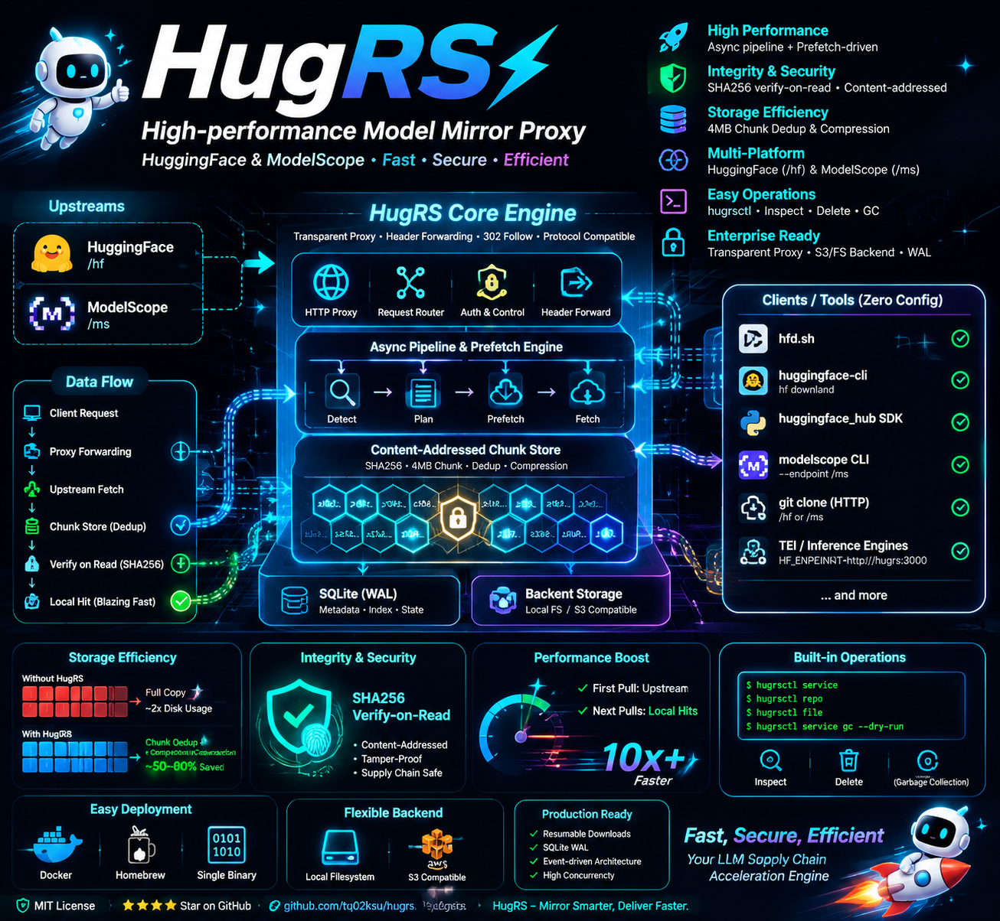

# HugRS

[](https://github.com/tq02ksu/hugrs/actions/workflows/ci.yml)
[](https://github.com/tq02ksu/hugrs/actions/workflows/security.yml)
[](https://github.com/tq02ksu/hugrs/actions/workflows/release.yml)
[](https://github.com/tq02ksu/hugrs/releases)
[](https://github.com/tq02ksu/hugrs/pkgs/container/hugrs)
[](LICENSE)
[](https://github.com/tq02ksu/hugrs/releases)
[](https://github.com/tq02ksu/hugrs/blob/master/Cargo.toml)
[](https://github.com/tq02ksu/homebrew-tap)

高性能 HuggingFace & ModelScope 模型镜像服务。基于 prefetch + 内容寻址架构，读时 SHA256 校验数据完整性，内置分块去重与压缩，保障大模型供应链安全与高速访问。



## 核心亮点

- **多平台支持** — 同时支持 HuggingFace (`/hf`) 和 ModelScope (`/ms`) 上游
- **完整性与安全** — SHA256 内容寻址，读时校验，SQLite WAL + 断点续传
- **高存储效率** — 4MB 分块去重 + 压缩，跨文件复用
- **全异步架构** — 全异步处理链路，事件驱动 prefetch，首次拉取后本地高速命中
- **易管理** — 内置 `hugrsctl`，支持 service 状态、repo/file 查看、删除与 GC
- **透明代理** — 完整转发上游 headers，兼容 HF Hub + ModelScope 协议
- **弹性部署** — 单二进制 + Docker，本地 FS / S3 双后端

## Docker

```bash
docker run -p 3000:3000 ghcr.io/tq02ksu/hugrs:0.6.1

# 指定镜像源 + 持久化缓存（使用命名卷）
docker volume create hugrs-cache
docker run -p 3000:3000 \
  -v hugrs-cache:/home/hugrs/.cache/hugrs \
  -e HUGRS_HF_ENDPOINT=https://hf-mirror.com \
  ghcr.io/tq02ksu/hugrs:0.6.1
```

## Homebrew

```bash
brew tap tq02ksu/tap
brew install tq02ksu/tap/hugrs
```

## 快速开始

```bash
# 启动守护进程
hugrs

# 可选：覆盖上游地址
HUGRS_HF_ENDPOINT=https://hf-mirror.com hugrs
HUGRS_MS_ENDPOINT=https://modelscope.cn hugrs

# 查看缓存状态
hugrsctl service
hugrsctl repo
hugrsctl file
hugrsctl service gc --dry-run
```

`hugrs` 是守护进程，`hugrsctl` 是管理客户端。管理面只暴露服务状态、repo/file 查看、删除和 GC；`chunk` 保持为内部实现细节，不面向用户。

[📖 CLI 详细文档 →](docs/CLI_zh.md)

## 运行目录

默认本地运行数据使用平台持久数据目录：

- macOS：`~/Library/Application Support/hugrs/chunks`
- Linux：`~/.local/share/hugrs/chunks`

默认控制面 token 文件：

- macOS：`~/Library/Application Support/hugrs/admin.token`
- Linux：`~/.local/share/hugrs/admin.token`

其它默认运行路径：

- 配置文件：
  macOS：`~/Library/Application Support/hugrs/hugrs.toml`
  Linux：`~/.config/hugrs/hugrs.toml`
  系统级：`/etc/hugrs/hugrs.toml`
- 元数据数据库：
  macOS：`~/Library/Application Support/hugrs/hugrs.db`
  Linux：`~/.local/share/hugrs/hugrs.db`

## 客户端使用

HugRS 作为透明代理运行，通过环境变量即可接入常用下载工具。

### hfd.sh

```bash
export HF_ENDPOINT=http://127.0.0.1:3000
hfd.sh Qwen/Qwen3.5-0.8B
```

### huggingface-cli / hf download

```bash
export HF_DEBUG=1 HF_HUB_DOWNLOAD_TIMEOUT=120 HF_HUB_DOWNLOAD_NUM_THREADS=1 HF_ENDPOINT=http://127.0.0.1:3000
hf download Qwen/Qwen3.5-0.8B
```

**初始化虚拟环境**

```bash
# 安装 uv：curl -LsSf https://astral.sh/uv/install.sh | sh
uv venv
uv pip install huggingface-hub
export HF_DEBUG=1 HF_HUB_DOWNLOAD_TIMEOUT=120 HF_HUB_DOWNLOAD_NUM_THREADS=1 HF_ENDPOINT=http://127.0.0.1:3000
uv run hf download Qwen/Qwen3.5-0.8B
```

### huggingface_hub SDK

```python
import os
os.environ["HF_ENDPOINT"] = "http://127.0.0.1:3000"
from huggingface_hub import snapshot_download
snapshot_download("Qwen/Qwen3.5-0.8B")
```

### modelscope download

```bash
modelscope download qwen/Qwen3.5-0.8B --endpoint http://127.0.0.1:3000/ms
```

**初始化虚拟环境**

```bash
# 安装 uv：curl -LsSf https://astral.sh/uv/install.sh | sh
uv venv
uv pip install modelscope
uv run modelscope download qwen/Qwen3.5-0.8B --endpoint http://127.0.0.1:3000/ms
```

### git clone

> [!WARNING]
> `git clone` + `git lfs pull` 会同时创建完整工作副本和本地代理缓存，磁盘占用约翻倍。推荐使用 `hfd.sh`、`huggingface-cli` 或 `modelscope` CLI 下载模型，仅拉取模型文件，无 git 额外开销。

```bash
git clone http://127.0.0.1:3000/Qwen/Qwen3.5-0.8B
git clone http://127.0.0.1:3000/hf/Qwen/Qwen3.5-0.8B
git clone http://127.0.0.1:3000/ms/qwen/Qwen3.5-0.8B
```

代理内部跟随上游 30x 跳转并合并响应头 — 以上工具除端点外无需额外配置。

### TEI (Text Embeddings Inference)

将 TEI 指向 HugRS 以缓存模型下载：

```bash
docker run --rm --gpus all -p 8002:80 \
  -e HF_ENDPOINT=http://your-hugrs-host:3000 \
  ghcr.io/huggingface/text-embeddings-inference:cpu-latest \
  --model-id Qwen/Qwen3-Embedding-0.6B
```

## HTTP API

[📖 OpenAPI Spec →](openapi.yaml)

## 存储架构

4MB 分块，SHA256 寻址：

```
.cache/hugrs/chunks/{sha256[0..2]}/{sha256[2..4]}/{sha256}
```

## 配置

优先级: env vars > `.env` > `hugrs.toml` > defaults

管理默认值：

- 控制面路径前缀：`/_hugrs/...`
- admin token 文件：
  macOS：`~/Library/Caches/hugrs/admin.token`
  Linux：`~/.cache/hugrs/admin.token`

`hugrsctl` 默认连接 `http://127.0.0.1:3000`。服务地址可通过 `--endpoint` 或 `HUGRS_CONTROL_ENDPOINT` 覆盖。admin token 按 `--admin-token`、`HUGRS_ADMIN_TOKEN`、当前平台默认 token 文件 的顺序解析。删除只移除文件缓存引用；`hugrsctl service gc` 负责按批回收 orphan chunk。

[📖 完整配置文档 →](docs/CONFIG_zh.md)

## 开发

从源码启动守护进程：

```bash
cargo run
cargo run -- --server-port 3001
cargo run -- --config ./hugrs.toml
HUGRS_HF_ENDPOINT=https://hf-mirror.com cargo run
HUGRS_MS_ENDPOINT=https://modelscope.cn cargo run
```

从源码使用管理客户端：

```bash
cargo run --bin hugrsctl -- service
cargo run --bin hugrsctl -- repo
cargo run --bin hugrsctl -- file
cargo run --bin hugrsctl -- service gc --dry-run
```

## 安装后使用

安装完成后，可直接运行守护进程和管理客户端：

```bash
hugrs
hugrs --server-port 3001
hugrs --config ./hugrs.toml
hugrsctl service
hugrsctl repo
hugrsctl file
```

## License

MIT
